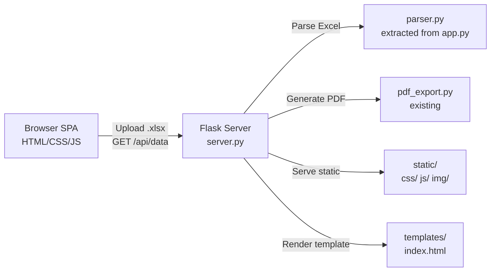

# Rolls-Royce SOA Dashboard -- Premium Frontend Redesign

## Architecture

Replace the Streamlit monolith with a Flask API backend serving a modern SPA frontend. The existing Excel parsing logic is extracted into a reusable module.




## File Structure

```
V5/
├── server.py                 # NEW - Flask API + routes
├── parser.py                 # NEW - Excel parsing logic (extracted from app.py lines 210-740)
├── pdf_export.py             # KEEP - existing PDF export
├── requirements.txt          # UPDATE - add flask, drop streamlit
├── templates/
│   └── index.html            # NEW - main SPA template
├── static/
│   ├── css/
│   │   └── dashboard.css     # NEW - all styles (variables, layout, components, animations)
│   └── js/
│       ├── app.js            # NEW - main app controller, file upload, API calls
│       ├── charts.js         # NEW - ApexCharts wrappers for all chart types
│       └── components.js     # NEW - KPI cards, tables, filters, section tabs
├── app.py                    # KEEP - original Streamlit version as backup
├── app_standalone.py         # KEEP - standalone version as backup
└── ...existing data files...
```

## Design System

**Aesthetic Direction**: Light premium -- inspired by the Stripe/Databox dashboard screenshot. Clean, airy, refined. Every shadow is intentional, every transition is silk-smooth.

**Typography** (loaded via Google Fonts CDN):

- Display/Headings: **"DM Sans"** (700, 800) -- geometric, modern, premium
- Body: **"Plus Jakarta Sans"** (400, 500, 600) -- refined readability
- Monospace/Numbers: **"JetBrains Mono"** -- crisp financial figures

**Color Palette** (CSS custom properties):

- `--rr-navy`: `#10069F` -- primary brand (headers, active states, chart accents)
- `--rr-deep`: `#0C0033` -- deep navy (sidebar, strong text)
- `--rr-royal`: `#1A0FB5` -- vibrant navy (hover states, focus rings)
- `--surface-primary`: `#FAFBFD` -- page background (warm off-white)
- `--surface-card`: `#FFFFFF` -- card backgrounds
- `--surface-elevated`: `#F4F5F9` -- subtle inset backgrounds
- `--border-subtle`: `#E8EAF0` -- card borders
- `--text-primary`: `#0F172A` -- headlines
- `--text-secondary`: `#475569` -- body text
- `--text-muted`: `#94A3B8` -- captions
- `--success`: `#059669` / `--success-light`: `#ECFDF5` -- credits, positive
- `--danger`: `#DC2626` / `--danger-light`: `#FEF2F2` -- overdue, negative
- `--warning`: `#D97706` / `--warning-light`: `#FFFBEB` -- aging warnings
- `--shadow-sm`: `0 1px 3px rgba(15,23,42,0.04)`
- `--shadow-md`: `0 4px 16px rgba(15,23,42,0.06)`
- `--shadow-lg`: `0 12px 40px rgba(15,23,42,0.08)`

**Spacing Scale**: 4px base (`--space-1` through `--space-16`), consistent padding/gaps.

**Border Radius**: `--radius-sm: 8px`, `--radius-md: 12px`, `--radius-lg: 16px`, `--radius-xl: 20px`.

## Key UI Sections

### 1. Sidebar (Fixed Left, 280px)

- Deep navy background (`--rr-deep`) with frosted glass effect
- RR logo lockup at top (text-based, elegant border treatment)
- File upload dropzone with drag-and-drop + animated upload indicator
- Dashboard view selector (pill buttons, not dropdown)
- Collapsible filter sections with smooth accordion animation
- Active filter count badges

### 2. Header Bar (Sticky Top)

- Full-width gradient banner: `linear-gradient(135deg, #10069F 0%, #1A0FB5 50%, #0C0033 100%)`
- Dashboard title + subtitle with staggered text reveal animation on load
- "ROLLS-ROYCE" logo mark (right-aligned, subtle border)
- Breadcrumb showing current view mode

### 3. Customer Info Bar

- Floating card with subtle elevation
- Customer name (large, bold), metadata chips in a flex row
- Animated entrance (slide up + fade in)

### 4. KPI Cards Row (6 cards)

- Glass-morphism cards with subtle backdrop blur
- Left accent border (color-coded: navy for neutral, green for positive, red for negative)
- Large numeric value in JetBrains Mono
- Micro-sparkline trend indicator (tiny SVG line)
- **Hover**: lift + shadow intensify + subtle scale
- **Load animation**: staggered cascade (each card delays 80ms)
- Total Overdue card is clickable (ripple effect on click)

### 5. Executive Overview (3 charts in grid)

- Section header: gradient pill with icon
- **Donut chart**: ApexCharts donut with animated segments, center label showing total
- **Grouped bar**: Charges vs Credits with gradient fills, rounded corners
- **Aging analysis**: Color-coded bars (green-to-red severity), hover tooltips
- All charts animate in with GSAP ScrollTrigger (fade up + scale from 0.95)

### 6. Bilateral Position (2 charts)

- Side-by-side cards with matched heights
- Horizontal bar charts with clean axis labels
- Animated bar growth on scroll into view

### 7. Section Breakdown (Tabbed)

- Custom tab bar (not browser default) -- pill-style tabs with active indicator slide animation
- Per-section: 5 KPI mini-cards + status pie chart + top items bar + data table
- Smooth tab content crossfade transition

### 8. Invoice Register

- Full-width filterable data table
- Sticky header row with sort indicators
- Filter bar with dropdowns and range slider
- Alternating row shading, hover highlight
- Virtual scrolling for large datasets (or paginated)
- Summary footer bar (filtered items, total, overdue)

### 9. Welcome State (No Files Uploaded)

- Centered hero with airplane icon (CSS-animated gentle float)
- Upload CTA with pulsing border animation
- Feature highlights in a 3-column card grid

## Flask API Endpoints


| Endpoint          | Method | Purpose                                  |
| ----------------- | ------ | ---------------------------------------- |
| `/`               | GET    | Serve `index.html` template              |
| `/api/upload`     | POST   | Accept .xlsx file(s), parse, return JSON |
| `/api/export-pdf` | POST   | Generate PDF report, return as download  |
| `/static/...`     | GET    | Serve CSS/JS/images (Flask auto)         |


`**/api/upload` response shape** (JSON):

```json
{
  "files": {
    "filename.xlsx": {
      "metadata": { "customer_name": "...", "customer_id": "...", ... },
      "sections": { "TotalCare": { ... }, ... },
      "all_items": [ { "Section": "...", "Amount": 123.45, ... }, ... ],
      "grand_totals": { "total_charges": ..., "total_credits": ..., ... }
    }
  }
}
```

The parser converts DataFrames to JSON-serializable dicts (dates become ISO strings, NaN becomes null).

## Animation Strategy

**Library**: GSAP 3 (loaded from CDN) with ScrollTrigger plugin.

**Page load sequence**:

1. Header gradient sweeps in (0.6s)
2. Sidebar slides in from left (0.4s, ease: power3.out)
3. Customer info card fades up (0.5s)
4. KPI cards cascade left-to-right (6 cards, 80ms stagger)
5. Charts fade up on scroll (ScrollTrigger, threshold: 20%)

**Micro-interactions**:

- Card hover: `transform: translateY(-4px)` + shadow deepen (CSS transition, 200ms)
- Tab switch: content crossfade (opacity 0->1, 250ms)
- Filter change: charts smoothly re-render (ApexCharts built-in animation)
- Button click: ripple effect (CSS pseudo-element)
- Upload progress: animated progress bar with pulse

## Implementation Notes

- `**parser.py**`: Extract lines ~210-740 from `app.py` (the `parse_soa_workbook` function and all its helpers). Replace pandas-specific return types with plain dicts/lists for JSON serialization. Keep pandas for internal processing but convert at the boundary.
- `**server.py**`: Flask app with CORS support. Store uploaded file data in server-side session or in-memory dict (keyed by session ID). Use `flask` and `flask-cors`.
- `**dashboard.css**`: Single CSS file with logical sections via comments. Use CSS custom properties throughout for theming. All animations defined as `@keyframes`. Responsive breakpoints at 1400px, 1200px, 768px.
- `**app.js**`: Controls file upload (drag-and-drop + file input), calls `/api/upload`, stores parsed data in JS state, orchestrates view rendering. Uses `fetch` API.
- `**charts.js**`: Wrapper functions for each chart type using ApexCharts. Consistent styling from CSS variables. Functions: `renderDonut()`, `renderGroupedBar()`, `renderAgingBar()`, `renderBilateralBar()`, `renderStatusPie()`, `renderTopItemsBar()`.
- `**components.js**`: DOM rendering functions for KPI cards, data tables, filter controls, section tabs. Each component is a function that returns an HTML string or directly manipulates DOM.
- **CDN dependencies** (no npm/build step needed):
  - GSAP 3 + ScrollTrigger: `https://cdn.jsdelivr.net/npm/gsap@3/`
  - ApexCharts: `https://cdn.jsdelivr.net/npm/apexcharts`
  - Lucide Icons: `https://unpkg.com/lucide@latest`
  - Google Fonts: DM Sans, Plus Jakarta Sans, JetBrains Mono
- `**requirements.txt**` update: Add `flask>=3.0.0` and `flask-cors>=4.0.0`. Keep `openpyxl`, `pandas`, `numpy`, `fpdf2`. Drop `streamlit` and `plotly` (no longer needed for the main app).

